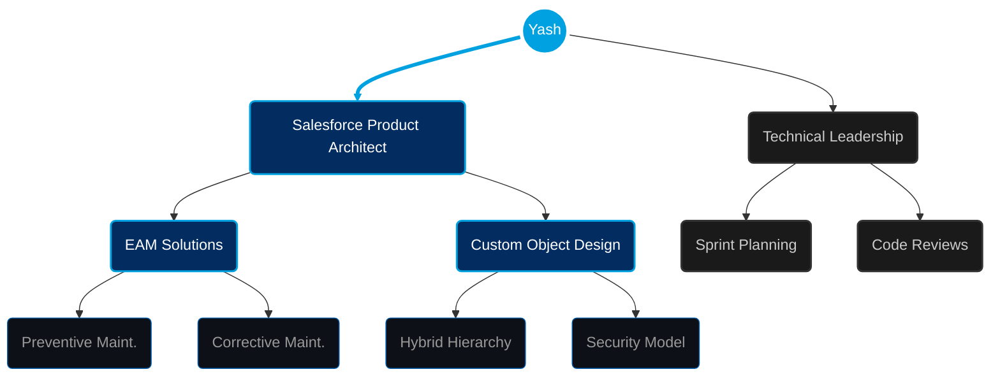

    

 

## ☁️ About Me

> Salesforce Product Architect specializing in designing scalable CRM-based Enterprise Asset Management (EAM) solutions. Experienced in architecting asset lifecycle, CM/PM, and work order management systems, while leading cross-functional engineering teams to deliver enterprise-grade platforms.

 

## 🤝 Connect With Me

 

## 🛠️ Tech Arsenal

<table align="center">
<tr>
<td align="center" width="250">

### ☁️ Salesforce Architecture

</td>
<td>

</td>
</tr>

<tr>
<td align="center">

### 🏭 EAM Specialization

</td>
<td>

</td>
</tr>

<tr>
<td align="center">

### 💻 Web & Integration

</td>
<td>

</td>
</tr>

<tr>
<td align="center">

### 🚀 DevOps & Leadership

</td>
<td>

</td>
</tr>
</table>

 

## 🎯 Current Focus

 

## 🏆 Profile Summary

  

    

