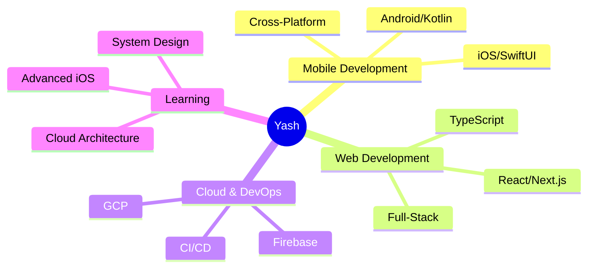

<div align="center">

<!-- Animated Header -->


</div>

<br>

## 🌐 About Me

```typescript
const yash = {
    role: ["Full Stack Developer @ YNV Solutions", "SDE @ EaziCore"],
    location: "India 🇮🇳",
    code: ["TypeScript", "Swift", "Kotlin", "Python", "Java", "C++"],
    focus: ["iOS Development", "Android Apps", "Web3", "DevOps"],
    motto: "Code. Create. Innovate. Repeat.",
    currentlyExploring: "Advanced iOS Development & Cloud Architecture",
    portfolio: "https://yash-engine.vercel.app"
};
```

<div align="center">

### 📊 Profile Analytics


</div>

<br>

## 🛠️ Tech Arsenal

<table align="center">
<tr>
<td align="center" width="200">

### 💻 Languages

</td>
<td>


</td>
</tr>

<tr>
<td align="center">

### 🌐 Web Dev

</td>
<td>


</td>
</tr>

<tr>
<td align="center">

### 📱 Mobile Dev

</td>
<td>


</td>
</tr>

<tr>
<td align="center">

### ☁️ Cloud & DevOps

</td>
<td>


</td>
</tr>

<tr>
<td align="center">

### 🔧 Tools

</td>
<td>


</td>
</tr>
</table>

<br>

## 📈 GitHub Analytics

<div align="center">
  
  
</div>

<br>

<div align="center">
  
</div>

<br>

## 🤝 Connect With Me

<div align="center">

[](http://www.linkedin.com/in/yash-raghuvanshi-a14361287)
[](https://twitter.com/yashraghu2006)
[](https://www.leetcode.com/yashraghuvans)
[](https://www.hackerrank.com/yashraghuvans)
[](https://auth.geeksforgeeks.org/user/yashraguzgo)
[](https://yash-engine.vercel.app)
[](mailto:yashraghuvans@gmail.com)

</div>

<br>

## 🎯 Current Focus

<div align="center">



</div>

<br>

---

<div align="center">

### 💭 *"The only way to do great work is to love what you do"*


**Made with 💜 by Yash Raghuvanshi**

<br><br>

<picture>
  <source media="(prefers-color-scheme: dark)" srcset="https://raw.githubusercontent.com/yashraghuvans/yashraghuvans/output/github-contribution-grid-snake-dark.svg">
  <source media="(prefers-color-scheme: light)" srcset="https://raw.githubusercontent.com/yashraghuvans/yashraghuvans/output/github-contribution-grid-snake.svg">
  
</picture>

</div>
