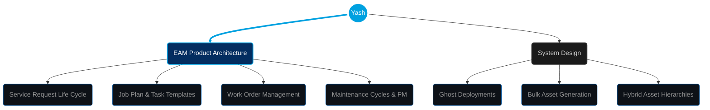

 

 

## ☁️ About Me

> **Salesforce Product Architect** specializing in **Enterprise Asset Management (EAM)**. I design end-to-end asset lifecycles—from Service Requests and Job Planning to Work Order execution and automated Maintenance Cycles. I bridge deep technical Apex/Flow knowledge with complex industrial maintenance logic.

 

## 🛠️ Domain & Technical Arsenal

| 🏗️ EAM Core Functional Pillars | ☁️ Salesforce Architecture |
| :--- | :--- |
|           |           |

| 💻 Web & Integration | 🚀 DevOps & Leadership |
| :--- | :--- |
|       |       |

 

## 🎯 Architectural Focus

## 🏆 Profile Summary

