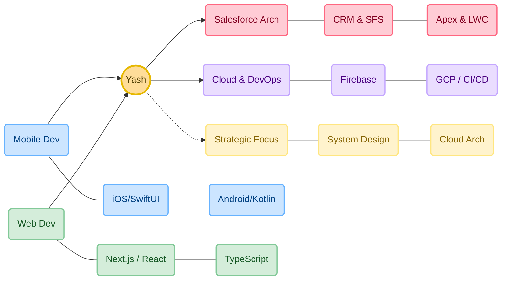

<div align="center">


</div>

<div align="center">


</div>
<div align="center">


    
</div>

<br>

## 🌐 About Me

```typescript
const yash = {
    role: [
        "Salesforce Product Architect @ EaziCore",
        "Ex-Full Stack Intern @ YNV Solutions"
    ],
    location: "India 🇮🇳",
    code: ["Apex", "TypeScript", "Swift", "Kotlin", "C++", "Python"],
    focus: [
        "Salesforce Ecosystem (CRM & SFS)",
        "iOS Development",
        "System Architecture",
        "DevOps"
    ],
    motto: "Architecting Scalable Solutions.",
    currentlyExploring: "Enterprise Cloud Patterns & Advanced iOS",
    portfolio: "https://yash-engine.vercel.app"
};
```


<br>

## 🛠️ Tech Arsenal

<table align="center">
<tr>
<td align="center" width="200">

### 💻 Languages

</td>
<td>


</td>
</tr>

<tr>
<td align="center">

### 🌐 Web Dev

</td>
<td>


</td>
</tr>

<tr>
<td align="center">

### 📱 Mobile Dev

</td>
<td>


</td>
</tr>

<tr>
<td align="center">

### ☁️ Cloud & DevOps

</td>
<td>


</td>
</tr>

<tr>
<td align="center">

### 🔧 Tools

</td>
<td>


</td>
</tr>
</table>

<br>

## 💎 Engineering Highlights

| Project & Scope | Architecture & Tech Stack | Lifecycle & Links |
| :--- | :--- | :--- |
| **☁️ AssetFlow-Pro**<br><sub>*Enterprise Asset Management (EAM)*</sub><br><br>An enterprise-grade system for tracking asset lifecycle, automated depreciation logic, and maintenance scheduling. | <br> <br>  | **🟢 Production ready** |
| **🎗️ SwiftCause Ecosystem**<br><sub>*Cross-Platform Donation Engine*</sub><br><br>A dual-interface platform connecting UK Nonprofits with donors. Features a native iOS donor app and a responsive Next.js admin dashboard. |  <br> <br> | **🟢 Production Ready**<br><br>[📱 View iOS](https://github.com/Yashraghuvans/Swift_Cause_IOS) <br> [💻 View Web](https://github.com/Yashraghuvans/SwiftCause_Web) |
| **🤖 Gen-AI Labs**<br><sub>*AI & Computer Vision Research*</sub><br><br>Experimental repository for LLM integration and Vision models. Includes real-time video segmentation and prompt engineering pipelines. |  <br> <br> | **🔵 Active Research**<br><br>[🔗 View Lab](https://github.com/Yashraghuvans/Generative-AI) |
| **💸 FinFlow**<br><sub>*Fintech Analytics Dashboard*</sub><br><br>Analytics-heavy platform for tracking loan disbursements and builder payments. Features complex data visualization. |  <br>  | **🟢 Completed**<br><br>[🔗 View Code](https://github.com/Yashraghuvans/FinFlow) |

<br/>

## 📈 GitHub Analytics
<div align="center">
  
</div>
<br>


## 🎯 Current Focus

<div align="center">


</div>
<br>

## 🏆 Profile Summary

<div align="center">
  
</div>
<br/>

## 🤝 Connect With Me

<div align="center">

[](http://www.linkedin.com/in/yash-raghuvanshi-a14361287)
[](https://twitter.com/yashraghu2006)
[](https://www.leetcode.com/yashraghuvans)
[](https://www.hackerrank.com/yashraghuvans)
[](https://auth.geeksforgeeks.org/user/yashraguzgo)
[](https://yash-engine.vercel.app)
[](mailto:yashraghuvans@gmail.com)

</div>

<br>
    
---

<div align="center">

</div>
